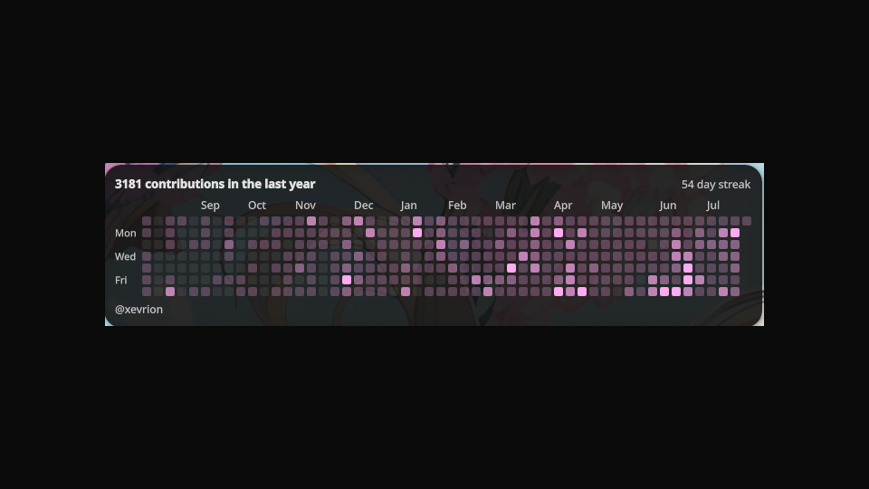
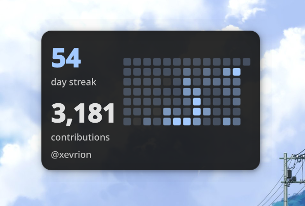

# GitHub Contributions

Displays your GitHub contribution graph as a desktop widget, themed with your Noctalia colors.

| Full graph | Compact stats |
|---|---|
|  |  |

## Data Sources

| Mode | API Key | Coverage |
|------|---------|----------|
| **Public profile** (default) | Not required | Public contributions (plus private if enabled in your GitHub profile settings) |
| **GraphQL API** | Personal access token | Exact counts including private contributions |

- Without a token, the widget reads the contribution calendar from your public GitHub profile.
- With a token (create one at [github.com/settings/tokens](https://github.com/settings/tokens) with `read:user` scope), data comes from the GraphQL API.

## Features

**Desktop Widget**
- Contribution heatmap colored with the active Noctalia accent
- Two layouts: the full graph, or a compact stat card with big streak and total numbers beside a 13-week grid
- Total contributions and current streak
- Month and weekday labels
- Today's contribution count next to the username
- Hover a cell to see that day's contribution count (needs Noctalia >= 4.7.2, where desktop widgets accept mouse input)

**Settings**
- GitHub username
- Optional personal access token
- Layout: full graph or compact stats
- Weeks shown (4-53)
- Refresh interval (15-360 minutes)
- Toggles for totals and labels

**IPC**
- Refresh: `qs -c noctalia-shell ipc call plugin:github-contributions refresh`

## Installation

```bash
git clone https://github.com/xevrion/noctalia-github-contributions ~/.config/noctalia/plugins/github-contributions
```

Restart the shell, enable the plugin in Settings → Plugins, and add the widget in Settings → Desktop Widgets. Set your GitHub username in the plugin's settings.

To update later: `git -C ~/.config/noctalia/plugins/github-contributions pull`

## License

MIT
